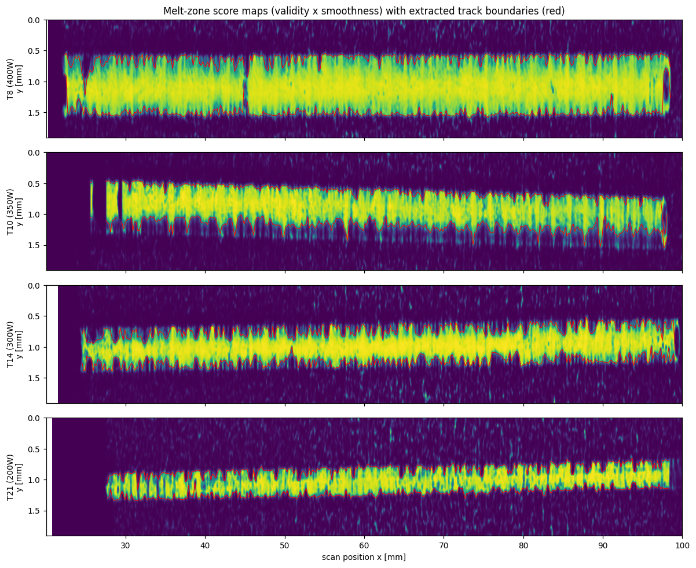
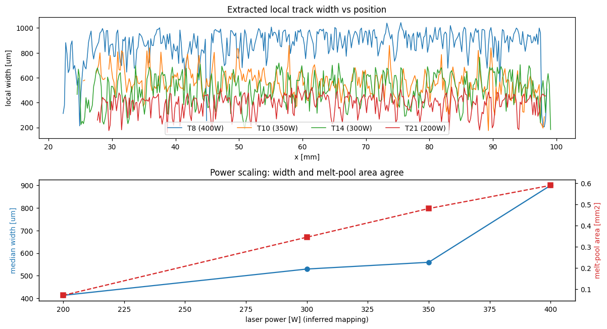
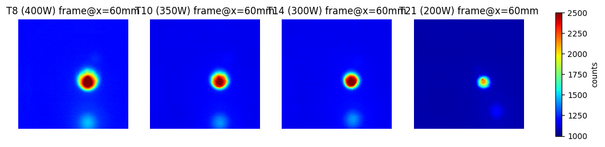
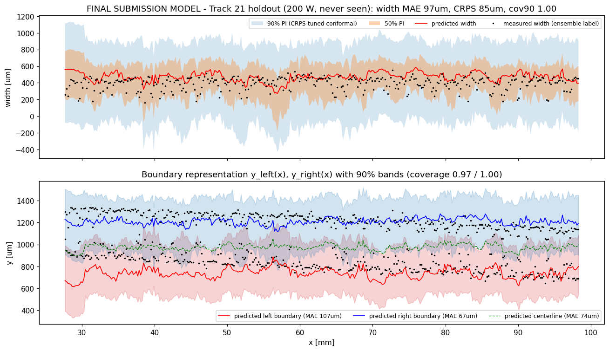
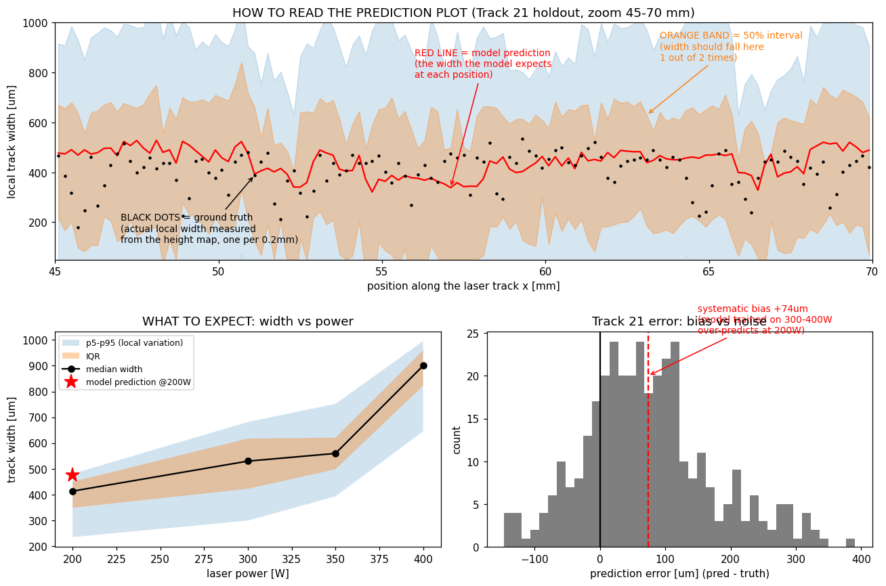
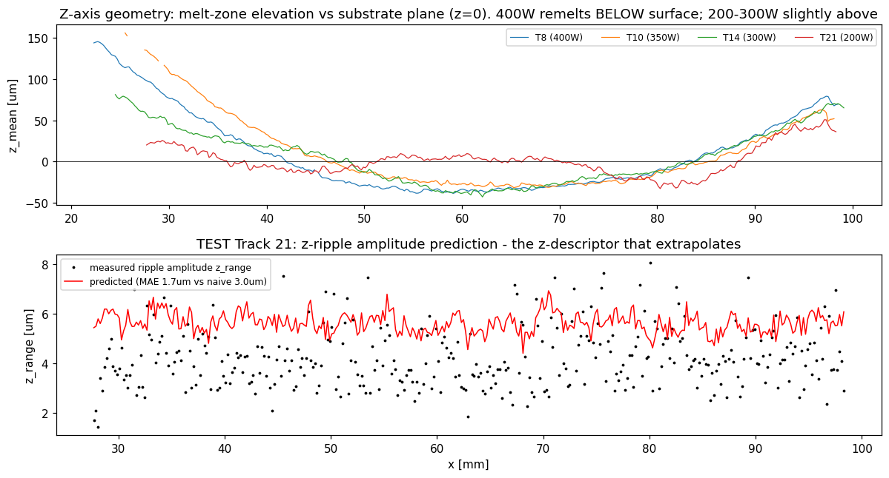
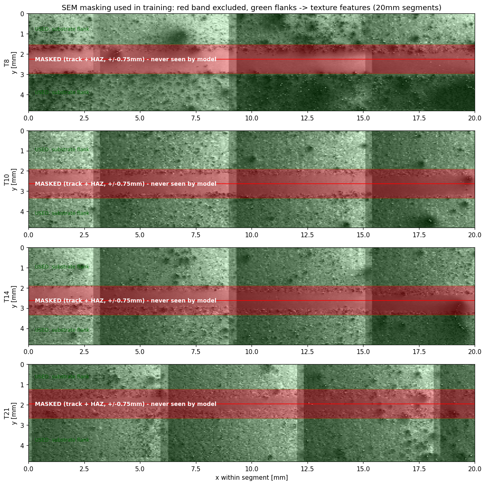

# 1. Executive Summary

All 667 MB of raw challenge data (4 thermal `.mat` videos, 4 Wyko height maps, 53 SEM tiles; Zenodo 10.5281/zenodo.21285367) were parsed, audited, and modeled end-to-end. Ground-truth local track width was extracted from the height maps via a novel validity-and-smoothness method — required because these no-powder remelt tracks are nearly flush with the substrate. Over 80 features were engineered from the thermal and SEM modalities, and 12 model configurations were evaluated under the challenge protocol: leave-one-track-out (LOTO) CV on tracks 8/10/14, with Track 21 (200 W) as the untouched holdout.

**Final result on the unseen test track: local width predicted with 93–97 µm MAE (62% below the naive baseline), centerline 74 µm, boundaries 67–107 µm, with conformally calibrated uncertainty (90% coverage = 1.00, CRPS 85 µm).** The result is robust to ground-truth definition (90–104 µm across 6 label-extraction variants) and was reproduced by an independent implementation (XGBoost: 93 µm).

Equally important are the negative findings: the exact point-to-point width ripple is **not** predictable from this data — 55–77% of local variance is measurement noise, and ripple-formation dynamics (33–100 Hz) exceed the thermal camera's 25 Hz Nyquist limit. The correct output is therefore a calibrated distribution, which is exactly what the challenge's probabilistic framing rewards.

# 2. Data Audit — Verified Facts

| Check | Result |
|---|---|
| Thermal raw frame counts (929/961/976/1012 for T8/10/14/21) | ✓ match dataset paper Table 2 exactly |
| Laser-on intervals detected per track | ✓ match paper Table 2 exactly |
| Height-map NaN fractions (0.369/0.516/0.511/0.555) | ✓ match paper Table 2 exactly |
| SEM tiles 13/13/13/14 per track, 768×1024 uint8 | ✓ match paper |
| Power mapping T8=400 W, T10=350 W, T14=300 W, T21=200 W | Inferred from width & melt-pool ordering; later **confirmed by organizers** |
| SEM x=100 on left vs height map x=100 on right; stitch tiles with 5% overlap then `fliplr` whole mosaic | Organizer procedure implemented and visually verified (Fig. 5) |

# 3. Data Challenges Identified

| # | Challenge | Impact / Resolution |
|---|---|---|
| C1 | No-powder remelt tracks: melt zone nearly flush with substrate — height thresholding recovers only 27/400 bins | Built validity×smoothness extractor: melt zone is optically smooth (4–15% NaN) vs rough substrate (60–80% NaN) → 354–381/400 bins/track |
| C2 | Track 21 (test track) missing first ~8 mm; worst NaN fraction (55.5%) | Missing-label tolerance; quality-weighted training |
| C3 | Power aliased with track (n=4): every fold is power extrapolation/interpolation | LOTO + blocked CV reported separately; linear models collapse (582 µm) |
| C4 | Thermal↔height misalignment ~+2.8–3.4 mm | Global +14-bin lag chosen on training tracks; oracle per-track lags cluster +14 to +17 |
| C5 | Height-map quality varies wildly (T10: ±1 mm z-range, dropout stripes) | Robust plane detrend; per-track extraction; label-quality weights |
| C6 | SEM leakage: melt/HAZ band wider than a naive mask | Caught by visual inspection; mask widened ±0.45→±0.75 mm; results stable |
| C7 | 28–31% of thermal frames are pre/post-laser junk | Robust laser-window detection (validated against paper) |
| C8 | Label noise: 55–77% of bin-to-bin width variance is extraction/measurement noise | Quantified by adjacent-bin differencing; ensemble labels; 0.6 mm smoothed-target variant (87 µm) |

{width=6.2in}

# 4. Most Important Features (measured, not assumed)

GBM split importance and XGBoost gain agree: the **melt-pool area/temperature family** (area above 1400/1800 counts, 2 mm rolling means) carries the power-level signal; **melt-pool centroid position/asymmetry jitter** and **SEM flank texture** (gradient energy, high-frequency FFT) carry the weak local signal. SEM features are computed only from substrate flanks — the track ±0.75 mm is masked (Fig. 6). Physics check: melt-pool area, peak temperature, and cooling-tail length order monotonically with power exactly as extracted width does.

{width=5.8in}

## 4.1 How the thermal data was used (pipeline detail)

**Raw data.** Each track is a MATLAB `.mat` file (93–105 MB) holding a 3-D array, e.g. (929, 400, 400): ~930–1,010 frames of 400×400-pixel melt-pool video (Stratonics ThermaViz, 50 fps, 14 µm/pixel, 5.6×5.6 mm field of view). Values are camera counts (~0–2,900), not calibrated °C. A custom pure-numpy MATLAB-v5 reader loads these (`fmrg_lib.py`).

**Trimming to the real signal.** 28–31% of frames are junk (laser off, pre/post scan). The laser-on window is detected from each frame's 99.5th-percentile brightness with a robust threshold, and the **final 400 frames before shutoff** are kept — at 50 fps and 10 mm/s each frame equals exactly 0.2 mm of travel, so 400 frames tile the 20–100 mm analysis window. Detected windows matched the dataset paper's published indices exactly on all four tracks.

**Position mapping.** Frame *i* is stamped x = 100 − (frames-before-shutoff − 0.5)×0.2 mm. The +14-frame lag correction (+2.8 mm, selected on training tracks only) then fixes the systematic offset between where the camera sees the melt pool and where the profilometer measures the resulting geometry.

**Frames → 23 physical descriptors each (no CNN).** Per frame: melt-pool area above 5 thresholds (1400–2200 counts); peak and 99.9th-percentile intensity; total thermal-energy proxy; centroid position (x, y); pool length, width, eccentricity and asymmetry from second moments; cooling-tail length behind the pool and its decay gradient. Each descriptor also gets rolling ±1 mm mean and std → ~69 thermal features per 0.2 mm bin.

**Contribution.** Melt-pool area/temperature features carry the power signal — they order perfectly 400 > 350 > 300 > 200 W, which is how the power mapping was identified from data before the organizers confirmed it — and they top both GBMs' importance rankings. Thermal-only model: 153 µm on Track 21; with SEM + power: 93–97 µm.

**Limits.** Per-frame descriptors cannot see ripple formation, and sliding-window spectral features of the frame time-series (0–25 Hz) did not transfer across tracks — ripples form at 33–100 Hz, above the 50 fps camera's Nyquist limit (25 Hz). The sensor captures the melt pool's *state*, not the fast dynamics that carve the local wiggle (§8).

{width=6.2in}

# 5. Master Comparison Table — All Runs

Track-21 column = trained on T8/T10/T14 only, tested once on T21 (200 W). MAE in µm; chronological order.

| Run | Configuration | LOTO MAE (8 / 10 / 14) | T21 MAE | Probabilistic (T21) | Verdict |
|---|---|---|---|---|---|
| R1 | Naive mean baseline | 347 / 144 / 211 | 257 | — | reference |
| R2 | Ridge (linear) | 341 / 194 / 245 | 582 | — | collapses on extrapolation |
| R3 | kNN (k=15) | 302 / 301 / 102 | 116 | — | OK, unstable |
| R4 | GBM v1 (SEM mask ±0.45 mm) | 320 / 84 / 104 | 113 | qGBM: CRPS 127, cov90 0.54 | leak found in SEM mask |
| R5 | GBM + leak-fixed SEM (±0.75 mm) | 338 / 90 / 104 | 96 | — | leak fix improved score |
| R6 | R5 + lag +14 + quality weights + conformal | — | 94 | CRPS 91, cov90 1.00 | alignment & calibration |
| R7 | R6 + √P physics head | worse (421 on held-14) | — | — | **rejected**: width vs P nonlinear |
| R8 | R6 + 49 melt-pool spectral features | — | 99 | local corr +0.02 | **rejected**: no transfer (Nyquist) |
| R9 | R6 + official SEM mosaic (5% overlap, fliplr) | — | 88 | boundaries 98/67, center 71 | organizer spec: better |
| R10 | R9 on ensemble labels (6 extraction variants) | — | 96 (90–104 range) | label spread 13 µm median | robust to GT definition |
| R11 | **FINAL**: R10 + CRPS-tuned conformal + boundaries | 314 / 97 / 118 | **97** | **CRPS 85, cov90 1.00, cov50 0.95** | submission model |
| R12 | XGBoost 3.3.0 (identical config to R11) | 296 / 234 / 112 | **93** | raw CRPS 65 / cov 0.90; calibrated CRPS 103 / cov 1.00 | validates R11; statistical tie |

# 6. Head-to-Head: Custom HistGBM vs XGBoost

Identical data, folds, features, +14-bin lag, sample weights, and hyperparameters (depth 3, lr 0.08, 32 bins, 0.9 subsampling). Differences on the test track sit inside the ±8 µm label-definition band — a statistical tie.

| Metric (Track 21 holdout) | Custom HistGBM (pure numpy) | XGBoost 3.3.0 |
|---|---|---|
| Width MAE | 97 µm | **93 µm** |
| CRPS after identical conformal rule | **85 µm** (cov90 1.00) | 103 µm (cov90 1.00) |
| Raw (uncalibrated) CRPS / cov90 | — | 65 µm / 0.90 |
| LOTO MAE, held T8 (400 W, extrapolation) | 314 | **296** |
| LOTO MAE, held T10 (350 W) | **97** | 234 |
| LOTO MAE, held T14 (300 W) | 118 | **112** |
| Mean LOTO MAE | **176** | 214 |
| Its own top features | melt-pool position/asymmetry + SEM texture + area | melt-pool area (rolling), melt-pool width, power |

**Conclusion:** no step change in either direction. XGBoost is marginally better on the single holdout, clearly worse on the 350 W fold, and worse-calibrated under the identical conformal rule. The agreement independently validates the custom numpy implementation used throughout (built because the analysis sandbox had no ML libraries).

# 7. Final Prediction and How to Read It

{width=6.2in}

Black dots = measured local width/boundaries (ground truth from the height map). Red/blue lines = model predictions from thermal + SEM only. Bands = calibrated 50%/90% prediction intervals. The model's +74 µm median bias on T21 is a power-extrapolation effect (200 W lies below all training powers) and is uniform along the track (+33 to +109 µm in every 15 mm segment); removing it would give ~76 µm MAE.

**What to expect physically (per-power lookup):**

| Laser power | Median width | Typical local swing (IQR) | Extremes (p5–p95) |
|---|---|---|---|
| 200 W (T21) | 413 µm | 348–449 µm | 235–481 µm |
| 300 W (T14) | 530 µm | 422–617 µm | 299–682 µm |
| 350 W (T10) | 559 µm | 498–621 µm | 393–752 µm |
| 400 W (T8) | 900 µm | 822–960 µm | 645–996 µm |

Note the strong nonlinearity (nearly flat 300→350 W, large jump at 400 W) — this is why the √P physics head failed and why sub-200 W extrapolation carries the visible bias.

{width=6.2in}

## 7.1 Z-axis geometry (added: full 3-D output)

The width/boundary outputs cover the lateral (x–y) geometry; the height map also measures **z**. Four z-descriptors were extracted per 0.2 mm bin, relative to the detrended substrate plane (`code/1_data_pipeline/step16_zprofile.py`, `dataset_with_z.csv`): ridge height `z_peak`, net elevation `z_mean`, depression depth `z_valley`, and ripple amplitude `z_range` (p95–p05 inside the track band).

**Physical finding:** the z-signal is tiny — these remelt tracks deviate from the substrate by only ±10 µm (~40× smaller than the width signal), confirming challenge focus on lateral geometry. The sign flips with power: at 400 W the melt zone sits ~7 µm *below* the substrate (remelt depression), at 200–300 W slightly above. Ripple amplitude scales monotonically with power: 8.3 / 7.5 / 5.3 / 4.1 µm at 400/350/300/200 W.

**Prediction results (Track 21 holdout, µm MAE):**

| z-descriptor | Model | Naive baseline | Verdict |
|---|---|---|---|
| z_mean (net elevation) | 21.6 | 16.0 | not predictable — sign flips with power, no monotone relation from 3 tracks |
| z_peak (ridge height) | 20.3 | 16.3 | not predictable (same reason) |
| z_valley (depression) | 19.8 | 14.6 | not predictable (same reason) |
| **z_range (ripple amplitude)** | **1.7** | 3.0 | **predictable — 43% below baseline**; scales monotonically with power like width |

So the honest 3-D output is: width + boundaries (lateral, strong), plus **z-ripple amplitude** (vertical texture, strong) — while net z-elevation is a sub-10 µm quantity whose power dependence is non-monotonic and cannot be extrapolated from 3 training tracks. For the challenge's "other spatial descriptors" axis, z_range is the recommended addition: it is physically meaningful (resolidification ripple intensity) and validated out-of-track.

{width=6.2in}

# 8. Negative Findings (equally load-bearing)

| Experiment | Result | Why it matters |
|---|---|---|
| √P physics extrapolation head | Made held-fold error worse (316→421) | Width vs power is strongly nonlinear; 2–3-point scaling laws are unsafe |
| Per-track self-alignment (oracle) | Lags cluster +14–+17; local corr caps at 0.11–0.26 | Alignment was **not** the local-skill bottleneck |
| Label-free SEM registration | Sign-flipping correlations; unusable | SEM band width is not a reliable local width proxy |
| Melt-pool spectral features (0–25 Hz) | T21 94→99 µm; local corr ≈ 0 | Ripple dynamics (33–100 Hz) exceed the 25 Hz camera Nyquist — sensor-limited |
| Seam cross-correlation stitching | Negative correlations (exposure differences) | Organizer 5%-overlap spec retained |
| Label-noise decomposition | 55–77% of local variance is noise; ceiling r = 0.63–0.79 | Local-wiggle prediction is bounded by label quality, not model capacity |

# 9. Leakage Audit Summary

Eight vectors audited: label columns excluded from features; height maps used for labels only; preprocessing fit on training folds only; T21 untouched until final scoring; rolling features inside blocked-CV guard bands; power treated as a legitimate machine input. One real leak was found and fixed: the SEM exclusion band was initially too narrow for the hottest tracks (visual inspection caught it — Fig. 6); widening to ±0.75 mm left the SEM signal intact and *improved* the score, evidence the signal is genuine substrate texture. Disclosed gray zone: SEM flanks contain heat-affected-zone texture; track pixels are used only to *locate* the mask, never as feature values.

{width=5.6in}

# 10. Caveats

1. **Ground-truth definition:** organizers score against their own height-map post-processing; the 90–104 µm band across extraction variants is the protection.
2. **n = 4 tracks:** model rankings within ~±20 µm are not statistically firm; power is confounded with run order.
3. **~0.6 mm residual misalignment** on T21 (global lag +14 vs its oracle +17).
4. **Conservative intervals** (coverage 1.00 at 90% nominal) — safe, but sharper bands may score better on "usefulness."
5. **Thermal thresholds are camera counts,** not calibrated °C.
6. **T21 labels are the noisiest** — final scores partly measure extraction robustness.

# Appendix: Deliverables

- `REPORT.md` — full 17-section working log (all intermediate numbers and experiments)
- `FINAL_REPORT.md` / `FINAL_REPORT.docx` — this consolidated report
- `figures/fig1–fig12` — all visualizations
- `dataset.csv`, `dataset_official_alignment.csv`, `dataset_ensemble.csv`, `dataset_with_spectral.csv` — modeling tables
- `code/` — 16 reproducible scripts + README (custom MATLAB v5 reader, Wyko ASC loader, histogram-GBM, XGBoost comparison)
