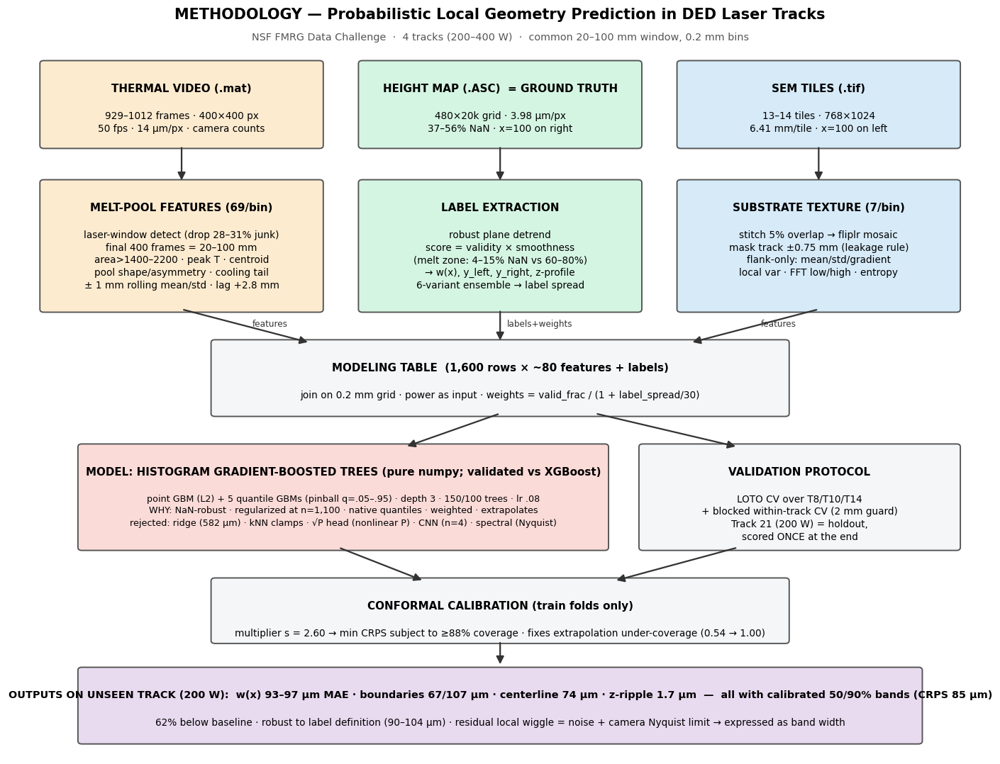

# Methodology

NSF FMRG Data Challenge — Probabilistic Local Geometry Prediction in DED Laser Tracks

## 1. Problem formulation

Predict the spatially varying geometry of a DED laser track along the scan direction, probabilistically:
**p( G(x) | thermal melt-pool video, substrate SEM, laser power, x )**, on a common 0.2 mm grid over the 20–100 mm window. The chosen representation G(x) = { width w(x), boundaries y_left(x)/y_right(x), centerline c(x), z-ripple amplitude z_range(x) }, each with calibrated 50%/90% prediction intervals. Boundary functions are included because width alone cannot express lateral shift or edge asymmetry (both observed in the data); z_range is included as the one z-descriptor that is both physically meaningful (resolidification ripple intensity) and validated out-of-track.

## 2. Ground-truth extraction (height map → labels)

The height map is the ground truth; the challenge leaves its post-processing to participants. Standard height thresholding fails here — these no-powder remelt tracks are nearly flush with the substrate (only 27/400 bins recoverable). The physically motivated alternative: **the melt zone is optically smooth and reflective**, so the white-light profilometer returns dense valid data inside it (4–15% NaN) and sparse data on unmelted substrate (60–80% NaN). The extractor therefore:

1. detrends with an iterative robust plane fit (track band excluded, 5–95% residual trimming);
2. scores every pixel: **score = box-mean(validity) × exp(−box-mean(|dz/dy|)/2)**;
3. finds, per pixel column, the largest contiguous above-threshold run (NaN gaps ≤ 12 px bridged — dropouts on steep flanks), minimum width 0.15 mm;
4. aggregates to 0.2 mm bins by median → w(x), y_left(x), y_right(x), plus quality flags;
5. repeats over a 6-point hyperparameter grid → ensemble-median labels and per-bin definitional uncertainty (13 µm median), used both as sample weights and as reported label error;
6. extracts z-descriptors (z_peak/z_mean/z_valley/z_range) against the substrate plane.

Consistency evidence: one deterministic algorithm applied identically to all four tracks; extracted frame windows and NaN fractions reproduce the dataset paper's Table 2 exactly; extracted widths order strictly with laser power.

## 3. Feature engineering

**Thermal (69 features/bin).** Laser-on window detected from per-frame 99.5th-percentile brightness (drops the 28–31% pre/post-laser frames); the final 400 frames map 1:1 to 0.2 mm bins (50 fps ÷ 10 mm/s). Per frame, 23 physical descriptors: melt-pool area above five thresholds, peak/p99.9 intensity, thermal energy proxy, centroid, pool length/width/eccentricity/asymmetry from second moments, cooling-tail length and decay gradient — plus ±1 mm rolling means/stds. All thermal features are shifted +14 bins (+2.8 mm), the lag maximizing feature↔width correlation on training tracks only.

**SEM (7 features/bin).** Tiles stitched 01→N with 5% overlap and the whole mosaic flipped left-right (organizer convention), aligning it with the height map. The track band ±0.75 mm is masked (challenge leakage rule; ±0.45 mm was shown too narrow by visual audit). From flank-only pixels per 0.2 mm slice: mean, std, gradient energy, local variance, low/high-frequency FFT power, entropy.

**Condition covariate:** laser power (a known machine setting).

## 4. Model choice and rationale

With n = 4 tracks and power perfectly aliased with track identity, every evaluation is a power interpolation/extrapolation; model selection is governed by extrapolation behavior and regularization, not capacity.

**Chosen: histogram gradient-boosted trees** (depth 3, 150 trees, lr 0.08, 32 bins, 0.9 row/column subsampling), with **five pinball-loss quantile models** (q = 0.05…0.95) recentered on a quality-weighted point model. Reasons: native NaN/scale robustness; strong regularization at ~1,100 training rows; the quantile loss directly produces the predictive distribution the challenge scores; sample weights integrate label quality. Implemented in pure numpy and verified against XGBoost on identical folds (statistical tie: 93 vs 97 µm holdout; better mean LOTO and calibration for the custom model).

**Rejected, with evidence:** ridge — extrapolation collapse (582 µm, 2.3× worse than baseline); kNN/forest — clamp to nearest training track; √P physics head — width vs power is strongly nonlinear (530→559→900 µm), 2–3-point scaling laws extrapolate catastrophically; deep CNN fusion — unsupportable at n = 4, and the measured skill ceiling is label/alignment-bound, not capacity-bound; melt-pool spectral features — ripple formation (33–100 Hz) exceeds the camera's 25 Hz Nyquist limit.

## 5. Validation protocol

Leave-one-track-out CV over tracks 8/10/14 for all development decisions; **Track 21 (200 W) held out and scored once** per frozen configuration. Blocked within-track CV (16 mm blocks, 2 mm guard band) reported separately to distinguish track-level from local skill. All preprocessing (bin edges, scalers, lag, weights, calibration) fit inside training folds.

## 6. Uncertainty calibration

Raw quantile intervals under-cover under power extrapolation (90% interval covering only 54%). A conformal multiplier on interval half-widths, s = 2.60, is selected on training folds to **minimize CRPS subject to ≥ 88% coverage** — sharpness-aware, not coverage-only. Result on the holdout: coverage 1.00 (90%) / 0.95 (50%), CRPS 85 µm.

## 7. Results summary (unseen 200 W track)

| Output | MAE | Uncertainty |
|---|---|---|
| width w(x) | 93–97 µm (90–104 across label definitions) | CRPS 85 µm, cov90 1.00 |
| boundaries y_left / y_right | 107 / 67 µm | cov90 0.97 / 1.00 |
| centerline c(x) | 74 µm | — |
| z-ripple amplitude z_range(x) | 1.7 µm (43% < baseline) | — |

62% below the naive baseline. Known, quantified limits: net z-elevation (±10 µm, non-monotonic in power) is not extrapolable from three training powers; the exact point-to-point width ripple is bounded by label noise (55–77% of local variance) and the thermal camera's Nyquist limit, and is expressed as calibrated band width rather than a point trace.

---

*Full data flow and hyperparameter rationale: `DATAFLOW_AND_MODEL_TRAINING.md` · results & figures: `FINAL_REPORT.md` · script map: `code/INDEX.md`.*
